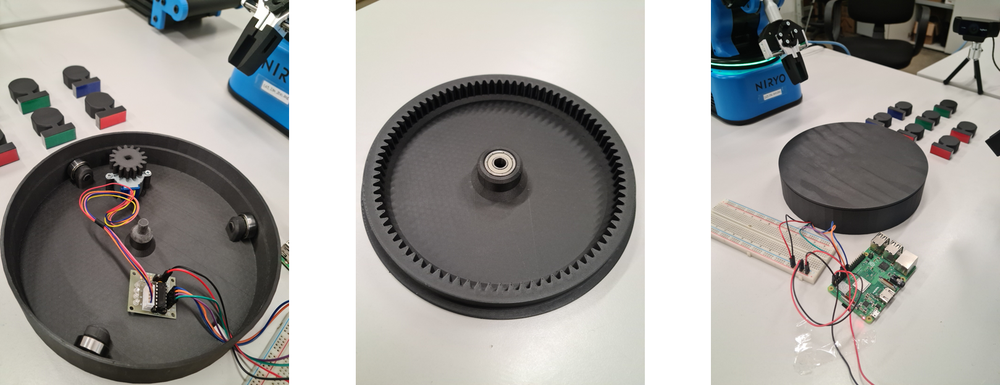
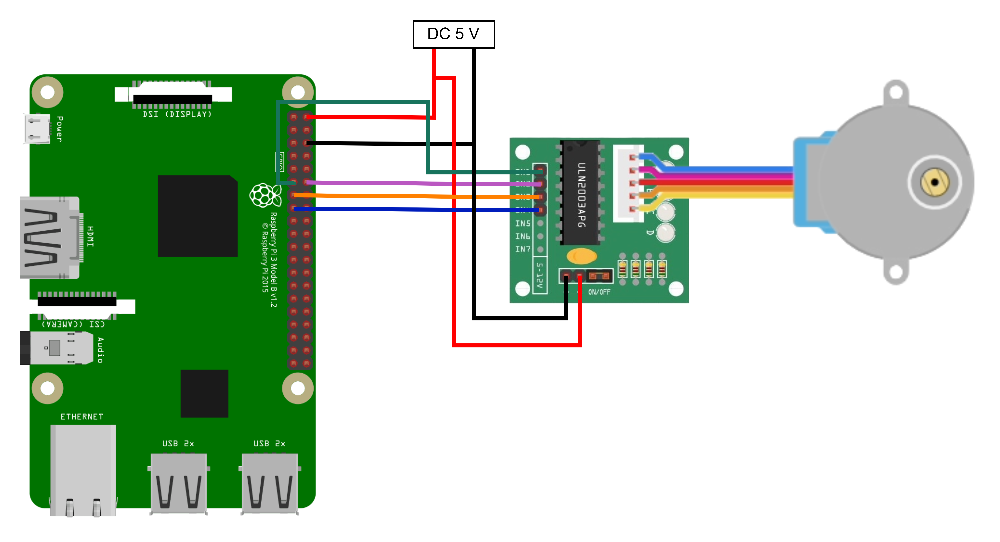

# Rotating Table

This package contains the script to control the rotating table and communicate its status with the production line.

For this project, a specific rotating table was designed. The 3D printed components have a minor effect on the implementation of the code (specifically, the number of steps needed to complete a specific rotation), but, in general, the code can be used to control any type of rotating table built with the same electronic components. Therefore, the focus will be on these components.

This is the rotating table built for this project:



The electronic components are the following:
- **Stepper Motor 28BYJ-48**
- **Driver ULN2003**
- **Raspberry Pi 3 B+**

On the Raspberry Pi, the OS *Ubuntu Server 20.04 LTS* is installed, as it allows the installation of ROS, which is used for communication between this device and the production line.

## Installation

The first step is to install the OS *Ubuntu Server 20.04 LTS*. This [tutorial](https://ubuntu.com/tutorials/how-to-install-ubuntu-on-your-raspberry-pi#1-overview "tutorial Ubuntu Server") explains how to do it. For the initial power-on, it is advisable to use an Ethernet connection to the Internet because Wi-Fi connection is not guaranteed. For the SSH connection, this command has fewer issues:


```bash
ssh <username>@<Raspberry Pi’s IP address>
```

Now, install ROS following the standard procedure. Look at this [tutorial](https://medium.com/geekculture/robot-operating-system-installation-configuration-and-auto-startup-on-a-raspberry-pi-with-ubuntu-6eb8e4e1038e "tutorial ROS on Ubuntu Server") for more information.

After ROS installation, clone the following repository into your ROS workspace:

```bash
git clone https://github.com/LucaCristuibGrizzi/rotating_table
```

Build you workspace:

```bash
catkin_make # or catkin build
```

## Setup

The correct wiring is crucial for making the rotating table work. The connections between the GPIO pins of the header of the Raspberry Pi and the driver inputs are as follows:
- GPIO 17 with IN1
- GPIO 18 with IN2
- GPIO 27 with IN3
- GPIO 22 with IN4

The power supply is connected directly to the appropriate pins of the Raspberry Pi. However, note that these pins lack protection from shortcuts or voltage spikes. Therefore, it is essential to ensure that the power supply is precise and stable. The following image shows the wiring used:



A highly recommended tip for simplifying the execution of ROS across multiple machines is to add the following commands to the *.bashrc* file of both the PC and the Raspberry Pi. These commands are necessary for running ROS across multiple machines, but you can choose to execute them every time you open a terminal or do it automatically by adding these commands to the *.bashrc* file:

```bash
export ROS_MASTER_URI=http://<ROS Master device’s IP address>:11311
export ROS_IP=<device’s IP address>
```

## Additional Information

The stepper motor 28BYJ-48, controlled in half-step, needs 64 steps to complete one revolution of the input shaft. The internal gearbox of the motor has a ratio of 1/64. So, 4096 steps are needed to execute a revolution of the output shaft. In the rotating table, a driving gear with 15 teeth is applied to the motor ($Z_{\textit{driving gear}} = 15$), and the top table has 85 internal teeth ($Z_{\textit{top table}} = 85$). This allows us to compute the motor steps needed for a rotation of the desired angle. In this case, the angle is 180°, and the resulting steps are 11605.

The computation is described by the following equation:

$$ \textit{Step Output Shaft} = \frac{\textit{Step Input Shaft}}{\textit{Gearbox Ratio}} = \frac{64}{\frac{1}{64}} = 4096 \textit{ steps}$$

$$ \textit{Step For 180° Rotation} = \textit{Step Output Shaft} \cdot \frac{Z_{\textit{top table}}}{Z_{\textit{driving gear}}} \cdot \frac{\textit{Desired Angle}}{360°} = \\ = 4096 \cdot \frac{85}{15} \cdot \frac{180°}{360°} = 11605 \textit{ steps}$$

## Libraries Version

- **ROS Noetic**: 1.16.0
- **Pyhton**: 3.8.10
- **RPi.GPIO**: 0.7.1